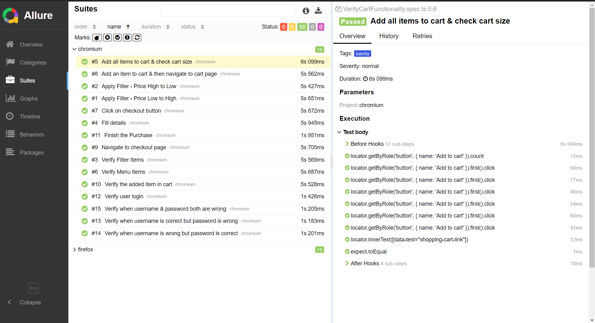

# Playwright Test Framework

## Project Overview

This is a test automation framework designed specifically for **[Swag Labs](https://www.saucedemo.com)**, utilizing Playwright and TypeScript to provide comprehensive end-to-end testing solutions for the Swag Labs e-commerce platform.

## Technologies Used

  
  
  
  
  

## Skills Demonstrated

- Proficient in **TypeScript**, enhancing code quality and developer experience.
- Strong understanding of **Playwright** for automated testing, including features like parallel execution and headless browsing.
- Experience with **CI/CD** practices, particularly with **Jenkins**, to streamline development workflows.
- Familiarity with **Allure** for test reporting, improving visibility and traceability of test results.
- Ability to create comprehensive documentation, improving project maintainability and onboarding for new team members.

## Report
   
